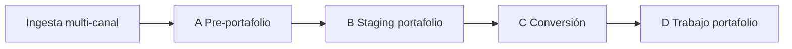

# tender_workflows

Monorepo del producto de licitaciones: **ingesta multi-canal**, decisión humana en portal, **conversión documental** e ** trabajo agentico en portafolio**.

> Histórico pre-monorepo: rama `archival/pre-restructure`, tag `v0.2-pre-workflows`. Repo anterior: [tender_procurement](https://github.com/rmichelena/tender_procurement) (archivado).

---

## Qué hace el sistema



| Etapa | Resumen | Estado |
|-------|---------|--------|
| **A** | Detectar o registrar item del pipeline, descargar docs, análisis rápido (free reader) | ✅ SEACE operativo |
| **B** | Elegir docs, uploads, aclaraciones → `portafolio/inputs/` | 📋 planificado |
| **C** | Normalización PDF→MD, índice (scripts + orquestador ante fallos) | 🔄 existe, sin integrar |
| **D** | BOM, specs, búsqueda, consolidado (agente) | 🔄 existe, sin integrar |

Modelo canónico: **[docs/STAGES.md](docs/STAGES.md)**. Fuentes/entrypoints: **[docs/INPUT_SOURCES.md](docs/INPUT_SOURCES.md)**.

---

## Estructura del repo

```
tender_workflows/
  apps/portal/              # Portal FastAPI + worker (etapa A)
  instrucciones/          # Runbooks A–D, prompts, schemas (etapas C–D + perfiles A)
  scripts/                  # Pipeline determinístico etapa C (extractors, run_step1)
  older_useful_material/    # Material legacy (proyecto/, reviews) — referencia
  docs/                     # Arquitectura, roadmap, etapas
  deploy/                   # Docker Compose VPS
  data/                     # Gitignored — tenants, procesos, BD
  config.example.yaml
```

Detalle de componentes: [docs/ARCHITECTURE.md](docs/ARCHITECTURE.md).

---

## Ingesta y entrypoints

No solo SEACE:

| Entrypoint | Ejemplo | Estado inicial |
|------------|---------|----------------|
| Scan automático | Worker + entidades activas (BD / Settings) | `publicada` |
| Alta directa (entidad/cliente + referencia) | SEACE u otro portal soportado | `descargada` |
| Change Detection → adapter | Portal privado/público de cliente | `publicada` o `descargada` |
| Email / mailbox | Estudio de mercado, specs preliminares, invitación privada | `descargada` |
| Creación manual | RFP no público, upload de expediente | `descargada` |

El usuario puede marcar **portafolio** sin **analizar**; el sistema ejecuta el free reader con perfil según `entity/source/workflow/stage`. El interés comercial vive en `interest_status` (`none`, `watching`, `candidate`, `opportunity`, `rejected`), separado del estado operativo. Ver [docs/STAGES.md](docs/STAGES.md) y [docs/INPUT_SOURCES.md](docs/INPUT_SOURCES.md).

---

## Quick start — portal SEACE (etapa A)

```bash
cp config.example.yaml config.yaml
cd apps/portal && python3 -m venv .venv && source .venv/bin/activate
pip install -r requirements.txt
export PYTHONPATH=.
export TENDER_REPO_ROOT="$(git rev-parse --show-toplevel)"
cd ../..
python -m seace_monitor scan --once -v
python -m seace_monitor web
```

UI local: `http://127.0.0.1:8000/` · Producción VPS: `http://bots.infinitek.pe:8080/`

### Docker

Stack **SQLite por defecto** (Postgres opt-in con `deploy/docker-compose.postgres.yaml`). Ver [deploy/README.md](deploy/README.md).

```bash
cp config.example.yaml config.yaml
cp deploy/.env.example deploy/.env
docker compose --env-file deploy/.env -f deploy/docker-compose.yml up -d --build
```

---

## Pipeline documental y extractores (etapa C)

Scripts determinísticos en `scripts/` (`run_step1_to_1_3.py`, extractors, `pdf_*`).  
Documentación técnica: **[docs/EXTRACTORS.md](docs/EXTRACTORS.md)**.

---

## Instrucciones para agentes

| Qué | Dónde leer |
|-----|------------|
| Visión A→D | [instrucciones/vision/flujo_completo.md](instrucciones/vision/flujo_completo.md) |
| Free reader / pre-portafolio | [instrucciones/A_pre_portafolio/](instrucciones/A_pre_portafolio/) |
| Staging portafolio (UI) | [instrucciones/B_staging_portafolio/](instrucciones/B_staging_portafolio/) |
| Conversión documental | [instrucciones/C_conversion/](instrucciones/C_conversion/) |
| Trabajo agentico portafolio | [instrucciones/D_portafolio/](instrucciones/D_portafolio/) |
| Patrones delegación | [instrucciones/shared/agent_patterns.md](instrucciones/shared/agent_patterns.md) |

Runbook legacy (deprecado): `instrucciones/01_workflow.md` → migrando a C/D.

---

## Documentación

| Doc | Contenido |
|-----|-----------|
| [docs/STAGES.md](docs/STAGES.md) | Etapas A–D, ingesta, layouts, renumeración |
| [docs/INPUT_SOURCES.md](docs/INPUT_SOURCES.md) | Fuentes, entrypoints, triggers, paquetes y perfiles |
| [docs/ARCHITECTURE.md](docs/ARCHITECTURE.md) | Capas, componentes, despliegue |
| [docs/ROADMAP.md](docs/ROADMAP.md) | Fases de producto |
| [docs/INTEGRATION.md](docs/INTEGRATION.md) | Portal ↔ pipeline |
| [docs/MULTI_TENANCY.md](docs/MULTI_TENANCY.md) | Tenants, paths, Hermes |
| [docs/HERMES_VPS.md](docs/HERMES_VPS.md) | Integración VPS |
| [docs/EXTRACTORS.md](docs/EXTRACTORS.md) | Extractores PDF/XLSX |
