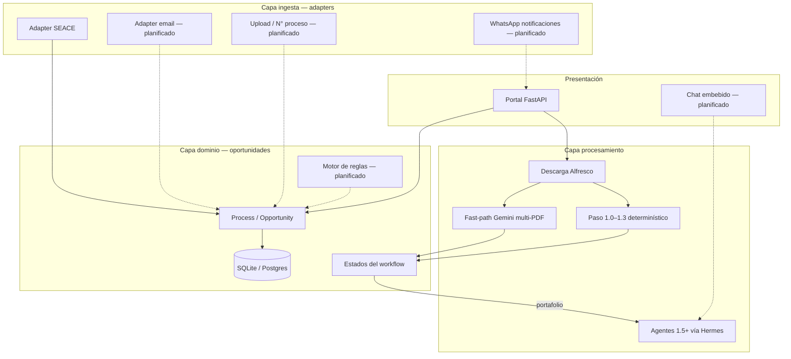
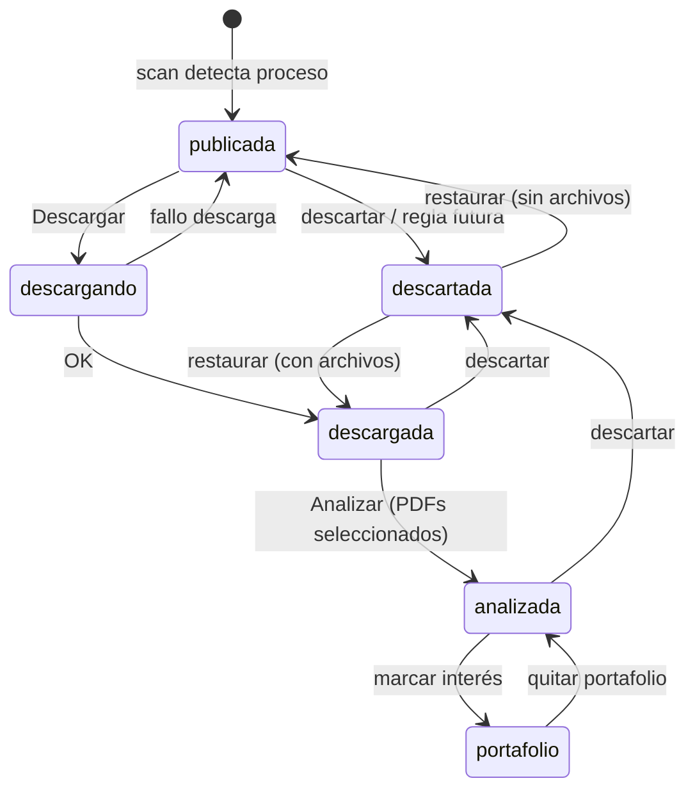

# Arquitectura — tender_workflows

Documento de referencia del sistema integrado: monitoreo SEACE, portal, pipeline documental y fase agentica.

**Estado:** refleja el código en `main` a mayo 2026.  
**Relacionado:** [STAGES.md](STAGES.md) (modelo canónico A→D), [ROADMAP.md](ROADMAP.md), [INTEGRATION.md](INTEGRATION.md).

---

## Visión en una frase

Un monorepo que **ingiere oportunidades** por múltiples canales y entrypoints (SEACE hoy; alta directa, manual y email planificados), permite **decisión humana** en el portal (etapas A–B) y conecta con **conversión documental** (etapa C) y **trabajo agentico en portafolio** (etapa D). Ver [STAGES.md](STAGES.md).

---

## Capas ortogonales

Tres dimensiones que no deben mezclarse en el modelo de datos:

| Dimensión | Qué es | Hoy | Futuro |
|-----------|--------|-----|--------|
| **Canal de ingesta** | De dónde llega la oportunidad | Adapter SEACE (`seace_monitor`) | Alta directa (entidad+N°), manual, email, otros portales |
| **Perfil de workflow** | Qué pasos ejecutar | `pe_public` implícito | `market_study`, `multilateral`, … |
| **Contexto de negocio** | Qué hacemos después del go/no-go | Portafolio manual | Catálogo, propuesta, flujo de caja |



---

## Bounded contexts (largo plazo)

| Contexto | Responsabilidad | En repo hoy |
|----------|-----------------|-------------|
| **Intelligence** | Ingesta, estados, expedientes, reglas | `apps/portal/seace_monitor/` |
| **Analysis** | Paso 1, fast-path, agentes, BOM | `instrucciones/`, `scripts/`, `analysis/` |
| **Catalog** | SKUs, specs, costos | No implementado |
| **Proposal** | Redacción, pricing | No implementado |
| **Finance** | Flujo de caja vs hitos licitación | No implementado |

Los contextos se acoplan por **ID de oportunidad** y paths bajo `data/tenants/{tenant_id}/procesos/`, no por un mega-schema único.

**Multi-usuario:** ver [MULTI_TENANCY.md](MULTI_TENANCY.md) — un despliegue, subdirectorios por tenant (settings, seace, procesos, agent), sin contenedor por usuario.

---

## Componentes actuales

```
tender_workflows/
  apps/portal/seace_monitor/
    scanner.py          # Worker multi-entidad: listado + ficha JSF
    client.py           # Cliente SEACE (ViewState, paginación)
    analysis/
      runner.py         # download() + analyze()
      fast_reader.py    # Multi-PDF → Gemini free reader
      document_prep.py  # ZIP/RAR, LibreOffice, merge PDF fallback
      tender_bridge.py  # Puente run_step1_to_1_3 + eje 0
    web/                # FastAPI + templates Jinja
    process_storage.py  # Descarte, limpieza disco/BD
  instrucciones/        # Runbooks A–D (ver STAGES.md)
  scripts/              # Pipeline determinístico etapa C
  deploy/               # Docker Compose VPS + .env
  data/                 # Gitignored: BD, procesos, artifacts
```

### Despliegue producción (VPS)

| Servicio | Rol |
|----------|-----|
| `web` | UI en `:8080`, jobs background descarga/análisis |
| `worker` | `python -m seace_monitor scan` cada `poll_interval` |
| Volumen `tender_data` | SQLite + `data/tenants/{tenant_id}/` (hoy `default`) |

Secrets: `deploy/.env` (`GEMINI_API_KEY`, `SEACE_HTTP_PROXY`).

**Hermes (opcional):** un gateway, mount del mismo `/data`; no un contenedor por usuario. Ver [HERMES_VPS.md](HERMES_VPS.md), [MULTI_TENANCY.md](MULTI_TENANCY.md).

---

## Flujo operativo actual (SEACE)



### Rutas del portal

| Ruta | Estados |
|------|---------|
| `/publicaciones` | `publicada`, `descargando` |
| `/descargados` | `descargada` — selección multi-archivo + Analizar |
| `/analizados` | `analizada`, `portafolio` |
| `/descartados` | `descartada` |

### Descarga

- Al pulsar **Descargar**: abre ficha SEACE en vivo → `documentos_json` (lista fresca) → Alfresco → ZIP descomprimido en `documentos/_extracted/`.
- El **scan no guarda** `documentos_json` (solo cronograma y metadatos de ficha).

### Análisis (fast-path, default en VPS)

1. Usuario marca N PDFs (default: archivos cuyo nombre contiene `bases` sin `anexo`).
2. Cada PDF se sube a **Gemini Files API**; una sola llamada `generateContent` con N partes + contexto SEACE.
3. Si falla multi-upload → fallback merge a un PDF.
4. Resultado: `free_reader_summary.md` + campos parseados en `analysis_results`.
5. Cronograma en UI viene de **ficha SEACE**, no del LLM.

### Análisis completo (alternativo, no default VPS)

`analysis.tender_procurement` → `run_step1_to_1_3.py` (LibreOffice, Modal Docling, eje 0). Convive con fast-path vía config.

---

## Modelo de datos (simplificado)

| Entidad | Campos clave |
|---------|--------------|
| `Entity` | RUC, nombre, activa |
| `Process` | `(entity_id, nid_proceso)`, status, objeto, descripción, cronograma_json, data_dir, documentos_json |
| `AnalysisResult` | status, alcance, requisitos, raw_json, timestamps |

**Deuda de diseño acordada:** renombrar `Process` → `Opportunity`, añadir `source` + `source_ref` cuando haya segundo adapter. Ver [ROADMAP.md](ROADMAP.md).

---

## Integración LLM (hoy vs planificado)

| Uso | Implementación hoy | Plan |
|-----|-------------------|------|
| Fast-path análisis | `google-genai` directo, modelo en `config.yaml` | Abstracción provider (GenAI, OpenRouter, Fireworks) + UI Settings |
| Paso 1.3b eje 0 | Gemini vía tender_bridge | Misma abstracción |
| Agentes 1.5+ | Hermes/OpenClaw externo (Telegram/Discord) | Chat embebido en portal |

---

## SEACE — notas técnicas

- UI JSF/PrimeFaces; ficha requiere POST con ViewState.
- Clave de proceso: `(entity_id, nid_proceso)`.
- **Ver en SEACE:** proxy `/seace/open/{id}` con `link_id` fresco (el índice de fila en BD envejece).
- ONGEI: param `anio` en URL no filtra; el scan usa `config.anio` + primera página por entidad (`max_pages: 1` por defecto).
- Ficha refresh periódico (`ficha_refresh_interval`) para cronograma aunque el listado no cambie.

---

## Referencias

- [ROADMAP.md](ROADMAP.md) — fases y prioridades
- [INTEGRATION.md](INTEGRATION.md) — detalle Paso 1 ↔ portal
- [STAGES.md](STAGES.md) — etapas A→D
- [instrucciones/C_conversion/](../instrucciones/C_conversion/) — runbook conversión
- [instrucciones/D_portafolio/](../instrucciones/D_portafolio/) — runbook agentico
- [apps/REVIEW.md](../apps/REVIEW.md) — hallazgos de revisión de código
