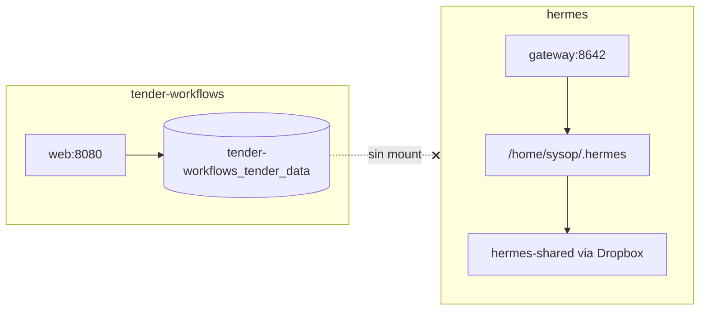

# Hermes en el VPS — investigación e integración de datos

Estado: investigación en `bots-sysop`, mayo 2026.

## Resumen

| Sistema | Contenedor(s) | Datos hoy | Puerto host |
|---------|---------------|-----------|-------------|
| **tender_workflows** | `tender-workflows-web-1`, `tender-workflows-worker-1` | Volumen Docker `tender-workflows_tender_data` → `/app/data` | **8080** |
| **Hermes** | `hermes` (+ `hermes-provision`, `hermes-debs`, `hermes-9`) | Bind `/home/sysop/.hermes` → `/opt/data` | **8642** gateway, **18001** webui admin, **30001** webui, **22001** SSH |

**Problema:** los documentos descargados viven en un volumen Docker **solo visible** para tender-workflows. Hermes **no** monta ese volumen; hoy los expedientes agenticos se arman a mano en `hermes-shared` (Dropbox).

**Acción recomendada:** volumen host compartido + montaje en ambos contenedores + permisos para usuario `hermes` (uid **10000**).

---

## Hermes — qué hay dentro

### Contenedor principal `hermes`

- **Imagen:** `hermes-webui-scarf:latest` (basada en `nousresearch/hermes-agent`)
- **Mount único:** `/home/sysop/.hermes` → `/opt/data` (`HERMES_HOME`)
- **Procesos:** gateway (`hermes gateway run`), webui admin (:8080 interno), Dropbox sync
- **Usuario de trabajo:** `hermes` (uid **10000**, gid **997**)

### Layout relevante en `/opt/data`

```
/opt/data/
  workspace/
    tender_procurement/     # clone git del pipeline (instrucciones/, scripts/, proyecto/)
    hermes-shared/          # symlink → home/Dropbox/hermes-shared
  home/Dropbox/hermes-shared/
    tender_geofisica/       # ejemplo: inputs/, artifacts/, logs/, overlay_usuario.yaml
    tender_rx_rayosx/
    ...
  .hermes/                  # sesiones, skills, webui, kanban.db
```

### Convención actual de proyectos Hermes (manual)

Cada licitación en `hermes-shared/tender_*`:

```
inputs/              ← PDFs y .md que el agente consume
artifacts/
logs/
outputs/
overlay_usuario.yaml
```

Ejemplo real: `tender_geofisica` con EETT en `inputs/` — copiados/subidos fuera del portal SEACE.

### tender_workflows — layout por proceso

```
/app/data/procesos/{nid}_{nomenclatura}/
  documentos/              # ZIPs Alfresco + manifest
  documentos/_extracted/   # PDFs descomprimidos
  fast_analysis/meta.json
  free_reader_summary.md   # salida fast-path
  tender_project/          # si corre Paso 1 completo
```

---

## Aislamiento actual (confirmado)



- Hermes **no** puede leer `/var/lib/docker/volumes/tender-workflows_tender_data/_data`.
- Archivos en tender-workflows: owner **root:root**; Hermes corre como **hermes:10000** → aunque montemos el path, hay que ajustar permisos o uids.

---

## Plan: volumen compartido (multi-tenant ready)

### Layout objetivo en host

Ver [MULTI_TENANCY.md](MULTI_TENANCY.md). Resumen:

```
/data/tenants/default/procesos/{nid}_{nom}/   ← portal hoy, mañana tenants/{id}/
/data/tenants/default/agent/                  ← home Hermes por tenant (futuro)
```

Dropbox / `hermes-shared` **no** entra en el flujo SEACE automático.

### 1. Persistir en path host (no solo volumen Docker anónimo)

```yaml
# deploy/docker-compose.vps.yml
services:
  web:
    volumes:
      - ${TENDER_DATA_DIR:-/home/sysop/tender_workflows/data}:/data
  worker:
    volumes:
      - ${TENDER_DATA_DIR:-/home/sysop/tender_workflows/data}:/data
```

Dentro del contenedor portal: `data_dir: /data/tenants/default` (config) o helper que resuelva paths.

**Migración:** copiar volumen nombrado → `/home/sysop/tender_workflows/data/tenants/default/procesos/`.

### 2. Montar el mismo `/data` en Hermes (un contenedor, N tenants)

```bash
-v /home/sysop/tender_workflows/data:/data:rw
```

Hermes sigue usando `/home/sysop/.hermes` → `/opt/data` para su config global; los **expedientes** viven en `/data/tenants/{id}/procesos/` montado aparte o bajo un segundo bind:

```bash
-v /home/sysop/tender_workflows/data:/data:rw
```

Cuando upstream tenga **multi-agent** estable: un agente por tenant con `home_dir: /data/tenants/{id}/agent`. **No** replicar contenedores `hermes-9`, `hermes-debs` por usuario.

| Host | Portal | Hermes |
|------|--------|--------|
| `.../data/tenants/{id}/procesos/` | `/data/tenants/{id}/procesos/` | mismo path |
| `.../data/tenants/{id}/agent/` | — | `home_dir` del agente |

Opciones (elegir una):

| Opción | Pros | Contras |
|--------|------|---------|
| **A.** `chown -R 10000:997` en `data/procesos/` tras cada descarga | Hermes lee/escribe directo | Portal (root) sigue OK; hay que hook post-descarga |
| **B.** Grupo compartido `tender` (997) + `chmod g+rwX` | Limpio multi-contenedor | Requiere groupadd y usuarios en imágenes |
| **C.** Hermes solo lectura `:ro` + artifacts en `hermes-shared/{id}/` | Separación clara | Duplicación parcial de paths en sesión |

Recomendación inicial: **A** para MVP (descarga deja dirs legibles por 10000) o **B** a medio plazo.

### 4. Mapeo portal → sesión Hermes (Fase 1 roadmap)

Al pulsar **Continuar con agente** en portafolio:

1. Resolver `process_id` → `/app/data/procesos/{nid}_{nom}/`
2. Pasar a Hermes (API o prompt de sesión):
   - `TENDER_PROCESS_DIR=/opt/data/tender_workflows/procesos/{nid}_{nom}`
   - `INPUTS_GLOB=documentos/_extracted/**/*.pdf`
   - `FREE_READER=/opt/data/tender_workflows/procesos/.../free_reader_summary.md`
   - Repo runbook: `/opt/data/workspace/tender_procurement/instrucciones/` (o monorepo montado)
3. Hermes arranca Paso 1.5+ leyendo esos paths — **sin copiar a Dropbox** salvo que quieras backup/sync.

No hace falta duplicar en `hermes-shared/tender_*` si el mount compartido existe; `hermes-shared` queda para casos manuales y overlays.

---

## Red y servicios Hermes

| Puerto host | Servicio |
|-------------|----------|
| 8642 | Gateway messaging |
| 18001 | WebUI / admin (:8080 interno) |
| 30001 | WebUI alternativo (:3000) |
| 22001 | SSH → usuario `hermes` |

- Hermes está en red **bridge** default; tender-workflows en **`tender-workflows_default`** — no comparten red Docker. Para integración HTTP portal→Hermes: red compartida o `host.docker.internal` / IP host.
- `hermes-provision` expuesto vía Traefik (`hermes-provision-bots`) — posible hook para provisioning de sesiones (investigar API Flask en :8080).

---

## Pasos concretos en el repo (pendiente implementar)

1. [ ] `docker-compose.vps.yml`: bind `TENDER_DATA_DIR` + doc en `deploy/.env.example`
2. [ ] Script `deploy/migrate-tender-data-volume.sh` para copia desde volumen nombrado
3. [ ] Documentar recreate de contenedor `hermes` con mount extra (operación manual en VPS)
4. [ ] Post-descarga: `chmod`/ACL para uid 10000 (código o script)
5. [ ] Fase 1: endpoint portal que abre sesión Hermes con `TENDER_PROCESS_DIR`

Ver [ROADMAP.md](ROADMAP.md) Fase 1.

---

## Notas

- **Dropbox (`hermes-shared`):** fuera del flujo SEACE; solo trabajo manual legacy si aplica.
- **Multi-contenedor Hermes hoy** (`hermes-debs`, `hermes-9`): patrón a **no** extender; ver [MULTI_TENANCY.md](MULTI_TENANCY.md).
- **Monorepo vs clone:** actualizar mount de `instrucciones/` desde `tender_workflows` en lugar de clone viejo en workspace.
