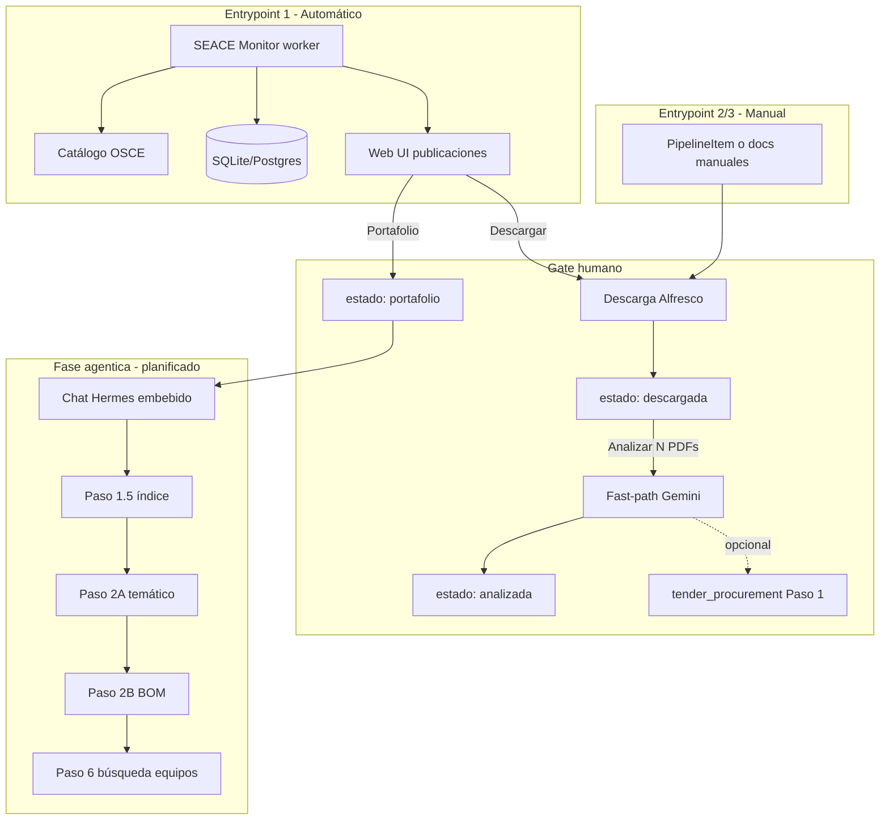

# Integración SEACE Monitor ↔ pipeline documental

**Documentación ampliada:** [STAGES.md](STAGES.md) (etapas A→D) · [INPUT_SOURCES.md](INPUT_SOURCES.md) · [ARCHITECTURE.md](ARCHITECTURE.md) · [ROADMAP.md](ROADMAP.md).

## Visión del sistema completo



| Fase | Qué es | Componente |
|------|--------|--------------|
| Monitoreo SEACE | Listado multi-entidad, cronograma, estados | `apps/portal/seace_monitor` |
| Go/no-go rápido | Multi-PDF → Gemini free reader con perfil por fuente | `analysis/fast_reader.py` |
| Análisis documental completo | 1.0–1.3 + **1.2b** planos + **1.3b** eje 0 | `scripts/run_step1_to_1_3.py` |
| Extracción profunda | 1.5+, agentes, BOM | `instrucciones/` + Hermes (externo hoy) |

## Análisis: fast-path vs Paso 1 completo

| Modo | Cuándo | Qué hace |
|------|--------|----------|
| **Fast-path** (default VPS) | Usuario selecciona PDFs en `/descargados` | Sube N PDFs a Gemini; un `generateContent`; `free_reader_summary.md` |
| **Paso 1 completo** | `analysis.tender_procurement` + infra Modal/LibreOffice | Triage, clean, Docling, eje 0; layout `tender_project/` |

## Layout de carpetas

```
data/procesos/{nid}_{nomenclatura}/
  documentos/              ← PDFs/ZIPs descargados (Alfresco)
  documentos/_extracted/   ← contenido de ZIP/RAR
  fast_analysis/           ← meta.json del fast-path
  free_reader_summary.md   ← salida Gemini
  tender_project/          ← Paso 1 completo (si se ejecuta)
    inputs/
    artifacts/
    logs/decision_log.md
```

## Configuración

```yaml
analysis:
  fast_path:
    enabled: true
    gemini_model: gemini-2.5-pro
    gemini_api_key_env: GEMINI_API_KEY
  tender_procurement:
    repo_path: null
    planos_mode: auto_leave
    run_axis0: true
    gemini_model: gemini-2.5-flash
```

Variables de entorno: `GEMINI_API_KEY`, `SEACE_HTTP_PROXY` (ver `deploy/.env.example`).

## Estados en la UI

| Estado | Significado |
|--------|-------------|
| `publicada` | Detectada en scan, sin descarga |
| `descargando` | Descarga en curso |
| `descargada` | Documentos en disco; pendiente analizar |
| `analizada` | Fast-path o Paso 1 completado |
| `portafolio` | Seleccionada para análisis profundo; implica `interest_status=opportunity` |
| `autorejected` | Rechazada por reglas automáticas de filtro |
| `descartada` | Descartada; sin datos locales |

Al descartar desde descargados/analizados: se borran disco, `documentos_json` y `AnalysisResult`.

El interés comercial se modela aparte como `interest_status` (`none`, `watching`, `candidate`, `opportunity`, `rejected`). Ver [INPUT_SOURCES.md](INPUT_SOURCES.md).

## Próximos pasos

Ver [ROADMAP.md](ROADMAP.md). Resumen:

1. Portafolio → chat Hermes embebido
2. Settings (GenAI / OpenRouter / Fireworks)
3. Prefiltros descarte + auto-análisis
4. Multiusuario
5. WhatsApp (API existente en otro proyecto)
6. Multi-ingesta: portales cliente, email, Change Detection como trigger y paquetes documentales

## Referencias

- [docs/STAGES.md](STAGES.md) — etapas A→D
- [docs/INPUT_SOURCES.md](INPUT_SOURCES.md) — fuentes, entrypoints y prompts por perfil
- [instrucciones/C_conversion/01_runbook.md](../instrucciones/C_conversion/01_runbook.md) — runbook conversión
- [scripts/run_step1_to_1_3.py](../scripts/run_step1_to_1_3.py) — runner Paso 1
