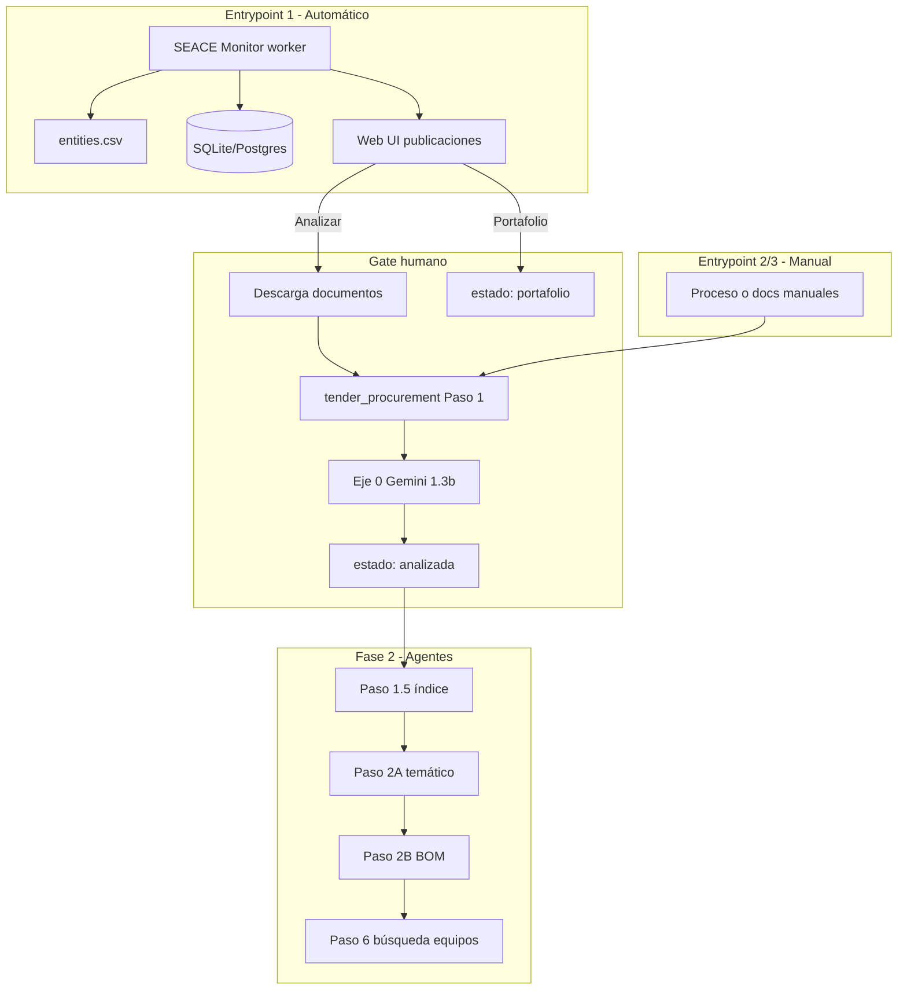

# Integración SEACE Monitor ↔ tender_procurement

## Visión del sistema completo

Tu borrador (`workflow licitaciones.txt`) y los dos repos encajan así:



| Fase | Qué es | Repo / componente |
|------|--------|-------------------|
| Monitoreo SEACE | Listado multi-entidad, cronograma, estados | **seace-monitor** |
| Análisis documental (hasta go/no-go) | 1.0–1.3 determinístico + **1.2b** Gemini planos + **1.3b** eje 0 | **tender_procurement** + puente |
| Extracción profunda + búsqueda | 1.5+, agentes, BOM, proveedores | **tender_procurement** (continuación manual o botón futuro) |

## Qué hace cada parte de tender_procurement en «Analizar»

| Paso | Tipo | Integración actual |
|------|------|-------------------|
| 1.0 Triage | Determinístico | `run_step1_to_1_3.py` |
| 1.0.b XLSX | Determinístico | idem |
| 1.1 DOCX→PDF | LibreOffice | idem |
| 1.2 PDF clean | `pdf_image_audit.py` | idem |
| **1.2b Planos** | **Gemini visión** | `planos_mode: auto_leave` (continúa sin Gemini) o `stop` (falla y pide JSON manual) |
| 1.3 Modal Docling | API Modal | idem |
| **1.3b Eje 0** | **Gemini texto** | `run_axis0_gemini()` si `GEMINI_API_KEY` |
| 1.5+ | Agentes | **No** — solo tras gate «Continuar» en flujo completo |

## Layout de carpetas al analizar

```
data/procesos/{nid}_{nomenclatura}/
  documentos/              ← PDFs/ZIPs descargados de SEACE (Alfresco)
  tender_project/          ← layout esperado por tender_procurement
    inputs/                ← copia de documentos/
    artifacts/
      step_1_normalizados/
      step_1_axis0_preindex/axis0_go_no_go_summary.md
    logs/decision_log.md
```

## Configuración

En `config.yaml`:

```yaml
analysis:
  tender_procurement:
    repo_path: null   # auto-detect raíz monorepo
    planos_mode: auto_leave   # auto_leave | stop
    run_axis0: true
    gemini_model: gemini-2.5-flash
    gemini_api_key_env: GEMINI_API_KEY
```

Variables de entorno:

- `GEMINI_API_KEY` — eje 0 (y futuro 1.2b visión)
- Modal Docling — credenciales en `tender_procurement/scripts/extractors/extractors.conf`

## Estados en la UI vs workflow

| Estado SEACE Monitor | Equivalente conceptual |
|---------------------|-------------------------|
| `publicada` | Detectada (entrypoint 1), sin análisis documental |
| `analizada` | Pasó descarga + etapa 1 (+ eje 0 si hubo API key) |
| `portafolio` | Gate 9 «interés» — candidata a Paso 1.5+ / búsqueda |

## Próximos pasos naturales

1. **1.2b Gemini real** — script que lea `step_1_planos_candidates_pending.json` y llame `prompt_planos_vision.md` (como subagente OpenClaw hoy).
2. **Botón «Continuar extracción»** — lanzar 1.5 + 2A solo para `portafolio`.
3. **Filtro entrypoint 1** — reglas de `workflow licitaciones.txt` §2 (entidad, tipo, objeto) antes de abrir ficha.
4. **Otros portales** — mismo patrón: adapter + misma BD.

## Referencias

- `tender_procurement/instrucciones/01_workflow.md` — runbook canónico
- `tender_procurement/scripts/run_step1_to_1_3.py` — runner determinístico hasta 1.3
- `workflow licitaciones.txt` — bosquejo entrypoints 1–3
