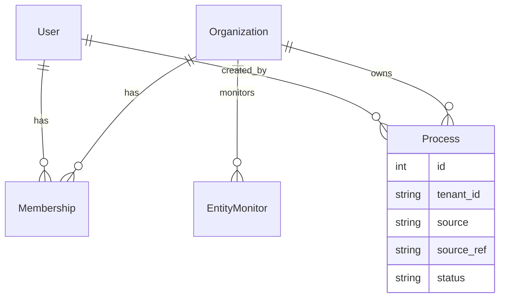

# Multi-tenancy — principios de diseño

Decisiones transversales para que el portal, los datos en disco y la capa agentica escalen a **varios usuarios sin un stack Docker por persona**.

**Relacionado:** [ARCHITECTURE.md](ARCHITECTURE.md), [HERMES_VPS.md](HERMES_VPS.md), [ROADMAP.md](ROADMAP.md) Fase 4.

---

## Principios

1. **Un solo despliegue** de portal + worker (+ opcionalmente un gateway de mensajería). No `docker compose` por usuario.
2. **Partición en disco por tenant** (usuario u organización): settings, cookies SEACE, expedientes, sesiones agente.
3. **Dropbox fuera** del camino crítico (sync lento, permisos, no multi-tenant). Datos en volumen host o object storage.
4. **BD es fuente de verdad** para ownership, permisos y estado; el filesystem refleja `tenant_id` + `process_id`.
5. **Hermes es un adapter opcional** de canal/agente, no el dueño del modelo de usuarios ni de los expedientes.
6. **Migración suave:** hoy un tenant implícito `default`; mañana `users` + `organizations` sin mover el monorepo.

---

## Modelo de identidad (objetivo)



| Concepto | Rol |
|----------|-----|
| **User** | Persona que inicia sesión en el portal |
| **Organization** | Equipo / empresa (opcional al inicio; un user = una org) |
| **Tenant** | Clave de partición en disco y en queries (`tenant_id` = org id o user id) |
| **Process** | Oportunidad/licitación; siempre scoped a `tenant_id` |

Reglas de acceso: un usuario solo ve procesos de sus orgs; admin de org gestiona `entities` y reglas de prefiltro.

---

## Layout en disco (canónico)

Volumen host compartido entre **portal**, **worker** y (si aplica) **un** contenedor Hermes:

```
/data/
  platform/                    # read-only: instrucciones/, scripts/ (montaje del repo)
  tenants/
    {tenant_id}/
      settings/
        portal.yaml            # providers LLM, modelos, poll_interval, …
        filter_rules.yaml      # prefiltros descarte / auto-análisis
      secrets/                 # gitignored; API keys si no van solo en env
      seace/
        cookies/               # sesión JSF por tenant (si no global)
        cache/
      procesos/
        {nid}_{nomenclatura}/  # igual que hoy: documentos/, free_reader_summary.md, …
      agent/                   # home Hermes u orquestador para este tenant
        sessions/
        memories/
        config.yaml            # overlay modelo/tools solo de este tenant
  _system/
    migrations/
    audit.log
```

**Hoy (pre-multiuser):** un solo tenant `default`:

```
/data/tenants/default/procesos/...
```

El código actual usa `data/procesos/` → migración: `data_dir = {base}/tenants/{tenant_id}/procesos` con `tenant_id=default`.

---

## Qué va dónde

| Dato | Ubicación | Notas |
|------|-----------|-------|
| Settings LLM (GenAI / OpenRouter / Fireworks) | `tenants/{id}/settings/portal.yaml` + UI | Fase 2 roadmap |
| Reglas prefiltro | `filter_rules.yaml` + columnas BD | Evaluadas en scanner |
| Entidades SEACE | Tabla `Entity` (catálogo OSCE + flag `activa`) | UI Settings; hoy tenant `default` |
| Documentos descargados | `tenants/{id}/procesos/.../documentos/` | Sin Dropbox |
| Cookies SEACE | `tenants/{id}/seace/` | Si varios usuarios abren SEACE distinto |
| Sesión chat agente | BD + `tenants/{id}/agent/sessions/` | Portal es dueño del `session_id` |
| SQLite/Postgres | global o por tenant | Empezar global con `tenant_id` en tablas |

---

## Hermes en un mundo multiusuario

### Qué es «profile» en Hermes hoy (v0.14 en VPS)

- `hermes profile` = **instalación/distribución** (modelo default, alias CLI, gateway asociado).
- En el VPS hay **un profile `default`** y contenedores extra (`hermes-debs`, `hermes-9`) = **otro HERMES_HOME por contenedor**, no multi-tenant dentro de un proceso.

Eso **no escala** al modelo que queremos (evitar N contenedores).

### Multi-agent en Hermes (PR #25660, aún no en v0.14)

Diseño upstream: **un gateway**, N agentes con `home_dir` separado y routing por metadata (Telegram user, chat, etc.).

| Escenario upstream | ¿Nos sirve? |
|--------------------|-------------|
| 1 gateway, N agentes, `home_dir` por agente | **Parcial** — si mapeamos `tenant_id` → agente |
| Routing por Telegram/Discord | Canales externos (Fase 5 WhatsApp) |
| Routing por sesión web del portal | **No documentado aún** — habría que enrutar por `agent_id` explícito al invocar |

**Conclusión:** Hermes puede seguir siendo el **motor de agente** (tools, skills, gateway WhatsApp) con **un contenedor** y N `home_dir` bajo `/data/tenants/{id}/agent/`, **cuando** exista multi-agent estable. No usar «un contenedor Hermes por usuario».

### Si Hermes no encaja en web multi-tenant

Plan B (compatible con el mismo layout de disco):

- Portal + **@cursor/sdk** u orquestador propio leyendo `instrucciones/`.
- LLM vía abstracción provider (GenAI / OpenRouter / Fireworks).
- Hermes solo para **Telegram/WhatsApp** como canal satélite, leyendo paths bajo `tenants/{id}/procesos/`.

La decisión se pospone hasta Fase 4; el **filesystem por tenant** sirve para ambos caminos.

---

## Implicaciones para decisiones **ahora**

| Decisión | Hacer | Evitar |
|----------|-------|--------|
| Volumen compartido VPS | Bind `/data` con árbol `tenants/default/` | Volumen Docker anónimo sin path host |
| Dropbox / hermes-shared | No usar para SEACE | Symlinks a Dropbox en flujo automático |
| Contenedores | 1× web, 1× worker, 0–1× Hermes gateway | 1× Hermes por usuario |
| Paths en código | `tenant_data_dir(tenant_id)` helper | Hardcode `data/procesos/` |
| BD | Preparar columna `tenant_id` nullable → `default` | Asumir un solo operador forever |
| Integración agente | Pasar `tenant_id` + path absoluto al continuar | Copiar PDFs a otro árbol manual |
| Permisos Unix | Grupo compartido o ACL por `tenants/{id}/` | root-only sin plan para uid 10000 |

---

## Fases alineadas

| Fase | Multi-tenant |
|------|----------------|
| **Ahora** | Tenant implícito `default`; documentar layout `tenants/` |
| **Volumen Hermes** | Montar `/data` en portal + Hermes; paths bajo `tenants/default/` |
| **Settings LLM** | Archivo por tenant desde el inicio |
| **Prefiltros** | Reglas por tenant |
| **Fase 4** | Auth, `users`, `organizations`, `tenant_id` en Process |
| **Agente** | `home_dir = tenants/{id}/agent` o SDK con mismo path |

---

## Migración desde el estado actual

1. Crear `/data/tenants/default/procesos/` y mover contenido de `data/procesos/`.
2. Introducir `AppConfig.tenant_id = "default"` y helper de paths.
3. Añadir `tenant_id` a modelos SQLAlchemy (default `'default'`).
4. Recrear Hermes con mount `/data:/data:rw` y `HERMES_HOME` o agent `home_dir` apuntando a subcarpeta (no todo `.hermes` mezclado con tenders).
