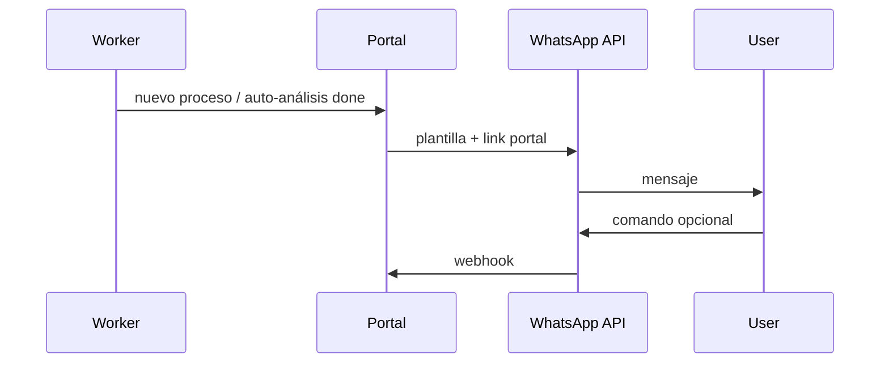
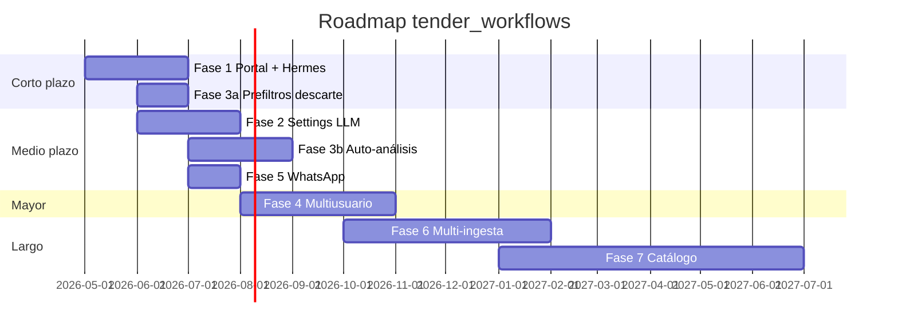

# Roadmap — tender_workflows

Roadmap del producto integrado (portal + ingesta + análisis + agentes).  
**Modelo de etapas:** [STAGES.md](STAGES.md) · **Fuentes:** [INPUT_SOURCES.md](INPUT_SOURCES.md) · **Arquitectura:** [ARCHITECTURE.md](ARCHITECTURE.md).

Última actualización: mayo 2026.

---

## Leyenda

| Símbolo | Significado |
|---------|-------------|
| ✅ | Hecho en producción o mergeado |
| 🔄 | En curso / usable con limitaciones |
| 📋 | Planificado, diseño acordado |
| 🔮 | Largo plazo |

---

## Estado actual (baseline ✅)

| Capacidad | Notas |
|-----------|-------|
| Scan SEACE multi-entidad | Worker 6h, savepoints, ficha refresh |
| Portal publicaciones → descargados → analizados | Estados separados descarga/análisis |
| Descarga Alfresco + ZIP/RAR | `documentos_json` solo al descargar |
| Análisis multi-PDF fast-path | Gemini 2.5 Pro, selección en UI |
| Portafolio manual | Sin botón «Continuar agente» aún; ver etapa B en [STAGES.md](STAGES.md) |
| VPS Docker | `bots.infinitek.pe:8080`, web + worker |
| Descarte con limpieza disco/BD | Incluye `documentos_json`, `AnalysisResult` |
| Proxy Ver en SEACE | Server-side ViewState |
| Puente Paso 1 completo | Existe; no es el camino default en VPS |
| Fundación multi-ingesta | `Process.source`/`source_ref`, registry `ingest`, fast reader por `source` (mergeado) |
| Segunda fuente: ADP Portal | `adp_portal` (scanner/watchlist/downloader propios), routing por `source` en worker/runner/UI (mergeado) |

---

## Fase 0 — Refactor de arquitectura de ingesta 🔄

**Objetivo:** convertir las fuentes en plugins reales y preparar feed/pipeline + multi-tenant **antes** de sumar más fuentes o más usuarios. Rama `ingest-plugin-contract`. Diseño completo en [INGEST_CONTRACT.md](INGEST_CONTRACT.md).

| Ítem | Descripción | Prioridad |
|------|-------------|-----------|
| 0.1 | **Contrato `SourceAdapter`** (discover/detect_changes/fetch/download/external_url/reader_profile) + DTOs normalizados; SEACE como primer ciudadano | Alta |
| 0.2 | **ADP al contrato:** colapsar `adp_scanner`/`adp_watchlist`/`adp_downloader` a un `AdpAdapter`; eliminar branching por `source` en worker/runner/UI | Alta |
| 0.3 | **Split Feed/Pipeline (lógico):** `FeedItem` (compartido, autopurge >90d) + `PipelineItem` (promoción por snapshot sin FK); sacar autoreject del scanner | Alta |
| 0.4 | **Identidad estable:** UUID interno + `ExternalRef` multi-canal; relajar `UniqueConstraint` atado a `source` | Media |
| 0.5 | **`lifecycle_phase`:** `estudio_mercado` como fase, no tipo separado | Media |
| 0.6 | **Multi-tenant (lógico):** `tenant_id` en pipeline/overlay; feed sin `tenant_id`; reglas y selección de entidades por tenant | Media |

**Definition of done:** agregar una tercera fuente = implementar un adapter (client+parser+url), sin tocar worker/runner/UI; el feed se escanea una vez y cada tenant lo filtra con sus reglas.

---

## Fase 1 — Cerrar el ciclo humano en el portal 📋

**Objetivo:** de ingesta a portafolio preparado (etapas A–B) y puente hacia C/D.

| Ítem | Descripción | Prioridad |
|------|-------------|-----------|
| 1.0 | **Etapa B:** UI staging (selección docs, upload, aclaraciones → `staging_manifest.json`) | Alta |
| 1.0b | **Multi-entrypoint:** alta directa entidad/cliente+referencia → `descargada`; creación manual | Alta |
| 1.0c | **Portafolio sin analizar:** disparar free reader con perfil por `entity/source/workflow/stage` | Alta |
| 1.0d | **Volumen compartido VPS:** bind `/data` con layout `tenants/default/`; montar en Hermes | Alta — prereq |
| 1.0e | **Interest status:** `none/watching/candidate/opportunity/rejected` independiente del estado operativo; `autorejected` queda como `status` operativo de reglas automáticas | Alta |
| 1.1 | Botón **Continuar conversión** → etapa C (`run_step1` / Hermes) | Alta |
| 1.2 | Chat embebido etapa D (Hermes gateway u Open WebUI acoplado) | Alta |
| 1.3 | Errores visibles: descarga/análisis fallido con mensaje en UI | Media |
| 1.4 | Modo **Conversión completa** opcional (C.1–C.4) además de fast-path A | Media |
| 1.5 | Traefik + `licitaciones.infinitek.pe` | Baja |

**Definition of done:** `portafolio/inputs/` preparado (B) → conversión C arrancable desde portal → agente D con contexto del expediente.

---

## Fase 2 — Settings y providers LLM 📋

**Objetivo:** configurar modelos sin editar YAML ni redeploy.

| Ítem | Descripción |
|------|-------------|
| 2.1 | Pantalla **Settings** en portal (admin) |
| 2.2 | Providers: **Google GenAI**, **OpenRouter**, **Fireworks** |
| 2.3 | Modelo por tarea: fast-path reader, eje 0, visión planos (1.2b), agentes |
| 2.4 | API keys por provider (env + override en BD cifrado o secrets manager) |
| 2.5 | Abstracción `LLMProvider` en código; fast_reader y tender_bridge consumen la misma interfaz |

**Notas de diseño:**

- Routing inicial puede ser YAML en BD; UI edita la misma estructura.
- Reutilizar ideas de `instrucciones/shared/model_routing.yaml` pero scoped al portal.
- Dependencia con **multiusuario** (Fase 4): settings globales vs por tenant.

---

## Fase 3 — Prefiltros heurísticos y auto-análisis 📋

**Objetivo:** reducir ruido en publicaciones y automatizar casos de alto valor.

### 3.1 Descarte automático (post-scan)

Reglas sobre campos del **listado/ficha** (sin descargar documentos):

| Regla ejemplo | Acción |
|---------------|--------|
| `objeto = servicio` **y** `descripción` contiene `legal` | → `autorejected` + motivo |
| `descripción` contiene `reparto` | → `autorejected` + motivo |
| Keywords configurables por entidad | → `autorejected` |

**Implementación propuesta:**

- Tabla o YAML `filter_rules` con: condiciones (campo, operador, valor/patrón), acción, prioridad, activo.
- Motor evalúa tras upsert en scanner; persiste motivo de rechazo automático en `Process`.
- UI en descartados muestra motivo; reglas editables en Settings (Fase 2).

### 3.2 Auto-descarga + auto-análisis

Reglas compuestas que disparan pipeline sin intervención:

| Regla ejemplo | Acción |
|---------------|--------|
| `objeto = bien` **y** `descripción` contiene `rayos x` **y** `descripción` **no** contiene (`hospital` **or** `salud`) | → descargar → analizar (PDFs default: bases + anexos según política) |
| Perfil por línea de negocio (equipos médicos vs industrial) | → distintos conjuntos de reglas |

**Implementación propuesta:**

- Misma DSL de reglas; acción `auto_pipeline` con pasos: `download`, `analyze`, `notify`.
- Cola de jobs con límite de concurrencia y presupuesto LLM diario.
- Opt-in por entidad; log de qué regla disparó cada proceso.
- Requiere prefiltros de descarte para no quemar API en basura.

### 3.3 SEACE estado en listado 🔮

- Trackear estado SEACE (desierta, cancelada, …) para descartar o archivar sin reglas de texto.

---

## Fase 4 — Multiusuario (overhaul mayor) 📋

**Objetivo:** varios usuarios/equipos con permisos, auditoría y aislamiento — **sin** stack Docker por usuario.

**Diseño:** [MULTI_TENANCY.md](MULTI_TENANCY.md)

| Ítem | Descripción |
|------|-------------|
| 4.0 | Layout `data/tenants/{tenant_id}/` (settings, seace, procesos, agent) — empezar con `default` |
| 4.1 | Auth (sessions/OAuth); login en portal |
| 4.2 | Roles: admin, analista, viewer |
| 4.3 | Entidades activas y prefiltros **por tenant** (tabla `Entity` + settings) |
| 4.4 | Acciones auditadas (descargar, analizar, descartar, portafolio) |
| 4.5 | Settings LLM por tenant (providers/modelos) |
| 4.6 | Schema: `users`, `organizations`, `memberships`, `tenant_id` en `Process` |

**Hermes en multi-tenant:** como mucho **un** gateway; `home_dir` por tenant bajo `tenants/{id}/agent/` cuando exista multi-agent estable upstream — no contenedores `hermes-N` por persona. Plan B: agente vía SDK + mismo árbol en disco.

**Impacto:** toca rutas web, BD, paths en código y deploy. Preparar `tenant_id=default` **antes** del overhaul reduce el dolor.

**Preparación ya acordada:** `Process` debe entenderse como `PipelineItem` conceptual, no como oportunidad. Oportunidad será `interest_status=opportunity`; paths vía `tenant_data_dir()`; Dropbox fuera del flujo automático.

---

## Fase 5 — Canales de comunicación 📋

**Objetivo:** notificaciones y comandos fuera del navegador.

| Canal | Uso | Notas |
|-------|-----|-------|
| **WhatsApp** | Alertas nuevas publicaciones, resumen análisis, confirmar portafolio | API ya existe en otro proyecto — integrar vía adapter HTTP |
| Telegram / Discord | Mantener para desarrollo agentes | Hermes/OpenClaw |
| Email | Forward/lectura de estudios de mercado e invitaciones directas | 🔮 Fase 6 |

**Integración WhatsApp (borrador):**

- Webhook en portal o microservicio ligero.
- Plantillas: «Nueva LP {nomenclatura} — fin consultas {fecha}» + deep link.
- No duplicar lógica de reglas; WhatsApp es **canal de salida/entrada**, no motor de reglas.

---

## Fase 6 — Multi-ingesta y perfiles de workflow 🔮

> Las bases de modelo (`PipelineItem`, `ExternalRef`, feed/pipeline, multi-tenant) se adelantan en **Fase 0** ([INGEST_CONTRACT.md](INGEST_CONTRACT.md)). Aquí quedan las fuentes nuevas y los perfiles completos.

| Ítem | Descripción |
|------|-------------|
| 6.0 | Modelo `PipelineItem` consolidado: `workflow_profile`, `interest_status`, `lifecycle_phase`, trigger separado de `source` (cimentado en Fase 0) |
| 6.1 | Adapter email (mailbox IMAP/POP → paquetes documentales; default `market_study`) |
| 6.2 | Segundo portal de cliente (parser/descarga por portal; Change Detection como trigger opcional) |
| 6.3 | Upload manual de expediente como fallback controlado |
| 6.4 | Workflow profiles: `public_tender`, `private_tender`, `market_study`, `multilateral` |
| 6.5 | Paquetes documentales versionados en manifest/disco; tabla formal después si hace falta |
| 6.6 | Prompt free-reader dinámico compuesto por `entity/source/workflow_profile/stage` |

---

## Fase 7 — Catálogo, propuesta, finanzas 🔮

| Contexto | Entregable |
|----------|------------|
| **Catalog** | SKUs propios, specs, costos → alimenta Paso 6 |
| **Proposal** | Generación propuesta desde BOM + catálogo |
| **Finance** | Flujo de caja vs cronograma contractual |

Puente natural: ítems BOM (`ITEM-{id}`) → `catalog_item_id` nullable.

---

## Orden de ejecución recomendado

1. **Fase 1** — valor inmediato; conecta lo que ya funciona con agentes.
2. **Fase 3a** — prefiltros descarte (barato, reduce ruido ~900 → actionable).
3. **Fase 2** — settings antes de escalar auto-análisis (control de costos/modelos).
4. **Fase 3b** — auto-pipeline con reglas de negocio (rayos X, etc.).
5. **Fase 5** — WhatsApp cuando haya eventos worth pushing.
6. **Fase 4** — cuando necesites más de un operador o cliente.
7. **Fases 6–7** — según segundo portal o línea de producto.

---

## Backlog técnico (de REVIEW.md)

Items de robustez no productizados; abordar cuando toque el área:

| ID | Tema |
|----|------|
| M5 | Warning si SEACE tiene más páginas que `max_pages` |
| 1.2b | Gemini real para planos (hoy `auto_leave`) |
| H2 | ✅ Mitigado con `ficha_refresh_interval`; revisar TTL |
| W1 | **Watchlist TTL adaptativo:** hoy refresh fijo cada 3h por proceso (`watchlist_refresh_seconds`). Refrescar más seguido (p. ej. 30–60m) los procesos con hitos de cronograma cercanos (fin consultas/presentación/otorgamiento en las próximas 24–48h) y dejar 3h+ para el resto. Evita latencia de hasta 3h para captar documentos publicados en etapas críticas (caso CORPAC: docs publicados 1 min después del último refresh, vistos 3h+ después). |

Ver [apps/REVIEW.md](../apps/REVIEW.md).

---

## Cómo contribuir a este documento

- Nuevas ideas → sección de fase correspondiente + línea en tabla.
- Ítem completado → mover a **Estado actual** con ✅.
- Cambios de arquitectura → actualizar [ARCHITECTURE.md](ARCHITECTURE.md) en el mismo PR.
