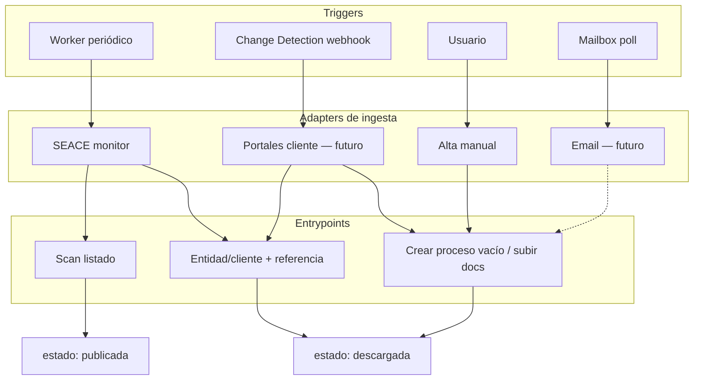

# Etapas del producto — modelo canónico A→D

Documento de referencia para nomenclatura, layouts en disco y orquestadores.  
**Relacionado:** [ARCHITECTURE.md](ARCHITECTURE.md), [INPUT_SOURCES.md](INPUT_SOURCES.md), [INTEGRATION.md](INTEGRATION.md), [ROADMAP.md](ROADMAP.md), [instrucciones/vision/flujo_completo.md](../instrucciones/vision/flujo_completo.md).

Última actualización: mayo 2026.

---

## Visión en una frase

El sistema lleva un **item del pipeline** desde cualquier **canal de ingesta** hasta decisiones de interés/análisis/portafolio, prepara un **expediente de portafolio**, lo **normaliza e indexa** (híbrido), y luego permite **trabajo agentico** (BOM, specs, procura, propuesta futura).

---

## Cuatro etapas ortogonales

| Etapa | Nombre | Naturaleza | Orquestador | Runbook |
|-------|--------|------------|-------------|---------|
| **A** | Pre-portafolio | Sistema (portal + worker) | Ninguno | [A_pre_portafolio/README.md](../instrucciones/A_pre_portafolio/README.md) |
| **B** | Staging → portafolio | Sistema (UI forms) | Ninguno | [B_staging_portafolio/README.md](../instrucciones/B_staging_portafolio/README.md) |
| **C** | Conversión / ingesta | Híbrido (scripts + agente ante fallos) | Opcional | [C_conversion/README.md](../instrucciones/C_conversion/README.md) |
| **D** | Trabajo en portafolio | Agéntico | Hermes / chat embebido | [D_portafolio/README.md](../instrucciones/D_portafolio/README.md) |

Cada etapa tiene **runbook propio** (o ninguno). El documento [flujo_completo.md](../instrucciones/vision/flujo_completo.md) describe el recorrido A→D sin ser un runbook monolítico ejecutable.

---

## Dimensiones que no deben mezclarse

| Dimensión | Qué es | Ejemplos |
|-----------|--------|----------|
| **Item base (`PipelineItem`)** | Unidad que entra al sistema | `Process` hoy; no equivale automáticamente a oportunidad |
| **Canal de ingesta (`source`)** | De dónde llegó el item | `seace`, `adp_portal`, `manual`, `email` |
| **Trigger** | Qué provocó revisar/crear el item | `scheduled_scan`, `change_detection_webhook`, `mailbox_poll`, `manual_create` |
| **Entidad/cliente (`Entity`)** | Comprador público o privado | SEACE entity, Aeropuertos del Perú, Aeropuertos Andinos |
| **Entrypoint** | Cómo entró al sistema | scan automático, alta directa por N° proceso, creación manual |
| **Estado del workflow** | Dónde está en el portal | `publicada` … `portafolio` |
| **Estado de interés** | Interés comercial independiente del workflow | `none`, `watching`, `candidate`, `opportunity`, `rejected` |
| **Etapa de procesamiento** | Qué pipeline corre | A (fast reader), B (staging), C (normalización), D (agente) |
| **Perfil de workflow** | Qué ruta/prompts ejecutar | `public_tender`, `private_tender`, `market_study`, … |

La BD ya comenzó a evolucionar hacia `Process.source` + `Process.source_ref` además de `entity_id` / `nid_proceso` (SEACE). La siguiente deuda es modelar `workflow_profile`, `interest_status` y paquetes documentales. Ver [INPUT_SOURCES.md](INPUT_SOURCES.md).

---

## Canales de ingesta y entrypoints



### Entrypoint 1 — Detección automática (SEACE hoy)

Worker escanea entidades/clientes configurados → items nuevos en **`publicada`**. Usuario descarga desde UI → **`descargada`**.

### Entrypoint 2 — Alta directa en portal soportado

Usuario indica **entidad/cliente + referencia** (p. ej. N° proceso SEACE o referencia de portal privado). El sistema:

1. Resuelve ficha vía adapter del canal.
2. Descarga documentos (Alfresco u equivalente).
3. Crea el registro directamente en **`descargada`** (sin pasar por `publicada`).

Aplica a cualquier adapter que implemente «fetch by reference» (`seace`, futuros portales con API o scraping estable).

### Entrypoint 3 — Creación manual

Usuario crea un item **sin detección automática**: invitación privada, RFP no publicado, expediente recibido por correo, etc.

- Metadatos mínimos (comprador, objeto, referencia interna).
- Upload inicial de documentos → **`descargada`**.
- `source=manual`, `source_ref` = referencia del usuario.

### Entrypoint 4 — Email / estudio de mercado

Mailbox dedicado recibe solicitudes preliminares, EETT o versiones nuevas.

- `source=email`, `trigger=mailbox_poll`.
- `workflow_profile=market_study` por defecto.
- Antes de crear un item nuevo, intentar asociar el mensaje/hilo a un item existente.
- Los adjuntos ingresan como paquete documental versionado.

---

## Estados del portal vs etapas A–D

| Estado UI | Etapa dominante | Notas |
|-----------|-----------------|-------|
| `publicada` | A | Solo detectado; sin archivos locales |
| `descargando` | A | Job de descarga |
| `descargada` | A | Documentos en disco; puede analizar o ir a portafolio |
| `analizada` | A | Fast reader completado + chat seguimiento opcional |
| `portafolio` | A→B | Análisis profundo seleccionado; normalmente hay interés, pero no equivale obligatoriamente a oportunidad |
| `portafolio_preparado` | B ✓ | *Planificado:* expediente copiado a `portafolio/inputs/` |
| `autorejected` | — | Rechazado por reglas automáticas de filtro; puede revisarse/restaurarse desde UI |
| `archivada` / `descartada` | — | Fuera del flujo activo |

`interest_status` puede cambiar en cualquier estado operativo: un item puede estar `descargada` + `candidate`, `analizada` + `opportunity`, o incluso `portafolio` + `candidate` mientras se decide.

### Atajo: portafolio sin analizar

En **cualquier canal** (SEACE, manual, etc.) el usuario puede marcar **`portafolio`** desde **`descargada`** sin pasar por **`analizada`**.

Comportamiento acordado:

1. Disparar el **free reader de etapa A** (perfil según `entity/source/workflow_profile/stage`) sobre los PDFs seleccionados o default del canal.
2. Persistir `free_reader_summary.md` + campos en `AnalysisResult` como si hubiera corrido «Analizar».
3. Transicionar a **`portafolio`** (o `analizada` + portafolio según implementación UI).

Así se reutiliza el pipeline de lectura rápida existente (perfiles en `A_pre_portafolio/`) en lugar de inventar un resumen distinto.

---

## Free reader (etapa A) — perfiles por fuente

El análisis rápido **no es un prompt único**. Depende del canal y, en alta manual, de la selección del usuario.

| Perfil | Canal / ruta | Cronograma del proceso | Prompt / construcción |
|--------|--------------|------------------------|------------------------|
| `seace` | SEACE | **No** extraer del PDF; UI usa `cronograma_json` de ficha | [free_reader_profiles.yaml](../instrucciones/A_pre_portafolio/free_reader_profiles.yaml) |
| `private_documents` | Portales cliente (AdP, Aeropuertos Andinos, etc.) | **Sí** cuando esté en documentos | Mismo archivo de perfiles |
| `market_study` (planificado) | Email / estudio preliminar | Normalmente no existe; no forzar | Prompt compuesto por perfil de workflow |
| `manual` | Alta manual | Según checkboxes UI | Prompt **dinámico** desde secciones elegidas |

Implementación actual: `fast_reader.py` elige prompt por `source` desde `free_reader_profiles.yaml`. Roadmap: prompt dinámico por `entity/source/workflow_profile/stage`.

Registro en expediente: `pre_portafolio/fast_analysis/profile.json` con `{ "profile_id", "sections_requested", "prompt_version" }`.

---

## Layout en disco por proceso

Bajo `data/tenants/{tenant_id}/procesos/{process_key}/`:

```
{process_key}/
  pre_portafolio/              # Etapa A — ingesta y análisis rápido
    documentos/                # descarga Alfresco / uploads iniciales
    documentos/_extracted/
    fast_analysis/
      profile.json
      meta.json
    free_reader_summary.md
    seace/                     # metadatos ficha si source=seace (opcional)
    packages/                  # paquetes documentales versionados (planificado)

  portafolio/                  # Etapas B–D — expediente de trabajo
    staging_manifest.json      # B: docs elegidos, aclaraciones, uploads
    inputs/                    # copia seleccionada + archivos extra
    overlay_usuario.yaml       # preferencias búsqueda (D.5)
    artifacts/                 # C y D: step_* del runbook
    outputs/
    logs/
```

**Compatibilidad:** hoy muchos paths viven en la raíz del proceso (`documentos/`, `free_reader_summary.md`, `tender_project/`). La migración a `pre_portafolio/` + `portafolio/` es incremental; helpers `tenant_paths` deben abstraer la resolución.

Convención legacy `proyecto/` en el repo = **plantilla de referencia** para layout de `portafolio/`; no confundir con `data/.../procesos/`.

---

## Renumeración del runbook legacy (pasos 1–7)

El runbook monolítico `instrucciones/01_workflow.md` se reparte así:

### Etapa C — Conversión

| Nuevo | Antiguo | Notas |
|-------|---------|-------|
| — | Gate 0 | **Eliminado** → UI etapa B + paths del portal |
| C.1 | 1.0–1.3 | Normalización determinística |
| C.2 | 1.4 | Merge aclaraciones; input desde `staging_manifest.json` |
| C.3 | 1.3b | Eje 0 sobre MD; **opcional** si A ya produjo free reader |
| C.4 | 1.5–1.5b | Índice estructural |

Orquestador: [C_conversion/00_orquestador.md](../instrucciones/C_conversion/00_orquestador.md) — solo ante fallos o pasos LLM (planos, merge, indexador).

### Etapa D — Portafolio

| Nuevo | Antiguo |
|-------|---------|
| D.1 | 2A |
| D.2 | 2B |
| D.3 | 3 |
| D.4 | 4 |
| D.5 | Gate 5 |
| D.6 | 6 |
| D.7 | 7 |

Orquestador: [D_portafolio/00_orquestador.md](../instrucciones/D_portafolio/00_orquestador.md).

---

## Gates humanos — dónde viven

| Gate legacy | Nueva ubicación |
|-------------|-----------------|
| Gate 0 (paquete documental) | Portal etapa B + layout `portafolio/inputs/` |
| Gate 0.a (aclaraciones) | Formulario UI etapa B (checkboxes / tipo por archivo) |
| Gate 1 (go/no-go eje 0) | Decisión en A (`analizada` / marcar portafolio); C.3 solo si hace falta re-validar sobre MD |
| Gate 5 (preferencias búsqueda) | UI antes de D.6 o `overlay_usuario.yaml` editado en portal |

---

## Integración LLM por etapa

| Uso | Etapa | Implementación hoy |
|-----|-------|-------------------|
| Fast reader | A | `fast_reader.py` + perfil por `source` |
| Chat seguimiento | A | `analysis_chat.py` + `A_pre_portafolio/prompts/seace_followup.md` |
| Paso 1 completo | C | `run_step1_to_1_3.py` vía `tender_bridge.py` |
| Agentes 2–7 | D | Hermes externo; chat embebido planificado |

---

## Orden de implementación (referencia)

1. **Paso 0 (este doc + esqueleto `instrucciones/`)** — nomenclatura y mapa.
2. **Etapa B** — UI staging + `staging_manifest.json` + layout `portafolio/`.
3. **Puente C** — botón conversión + paths + volumen compartido Hermes.
4. **Puente D** — orquestador D + chat embebido.
5. **Multi-ingesta** — `source`, entrypoints, `workflow_profile`, `interest_status`, paquetes y perfiles free reader completos.
6. **Migración física** — mover prompts/schemas; deprecar runbook monolítico.

Ver [ROADMAP.md](ROADMAP.md) para prioridades de producto.
