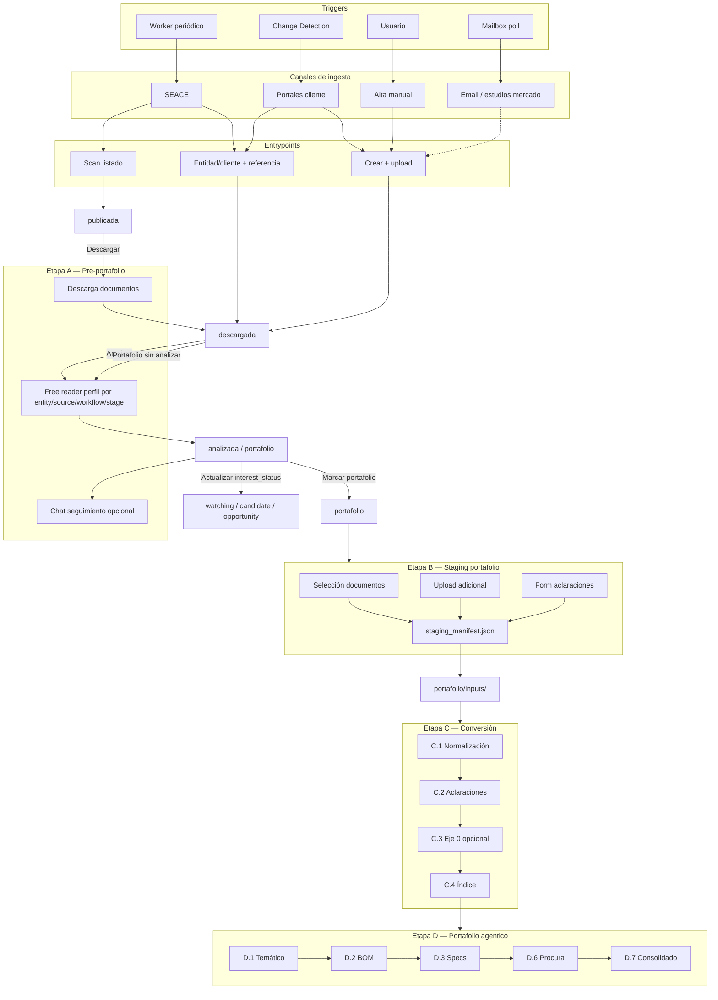

# Flujo completo A → D

Visión de extremo a extremo del producto **tender_workflows**.  
Este documento **no** es un runbook ejecutable: cada etapa tiene su propio README y orquestador (si aplica).

**Canónico:** [docs/STAGES.md](../../docs/STAGES.md) · fuentes/entrypoints: [docs/INPUT_SOURCES.md](../../docs/INPUT_SOURCES.md)

---

## Diagrama principal

---

## Recorrido típico por canal

### SEACE — scan → descarga → analizar → portafolio

1. Worker detecta proceso → `publicada`.
2. Usuario descarga → `descargada`, docs en `pre_portafolio/documentos/`.
3. Usuario analiza PDFs → free reader perfil **`seace`** (sin cronograma en PDF; UI muestra ficha).
4. `analizada` → usuario puede marcar `interest_status` y/o **`portafolio`**.
5. Etapa **B**: elige subset de PDFs + aclaraciones → `portafolio/inputs/`.
6. Etapa **C**: conversión determinística sobre `portafolio/inputs/`.
7. Etapa **D**: agente continúa BOM/procura.

### SEACE — alta directa (entidad + N° proceso)

1. Usuario ingresa referencia → adapter descarga → **`descargada`** (sin `publicada`).
2. Resto igual desde paso 3 arriba.

### Portal cliente (ej. Aeropuertos del Perú)

1. Change Detection puede disparar revisión, pero `source` sigue siendo el portal real del cliente.
2. Entrypoint **manual** o **directo** cuando exista adapter.
3. Free reader perfil **`private_documents`** — puede incluir cronograma y valor referencial extraídos de documentos.
4. Staging B igual; C/D comparten runbook con SEACE.

### Email — estudio de mercado / specs preliminares

1. Mailbox dedicado recibe correo con EETT o solicitud de cotización.
2. El sistema intenta asociar el hilo/documentos a un item existente; si no, crea uno nuevo.
3. Los adjuntos entran como paquete documental versionado.
4. Free reader perfil `market_study` (planificado): no fuerza cronograma, valor ni requisitos del postor.
5. Puede pasar a portafolio para BOM/candidatos antes de ser oportunidad.

### Manual — invitación no pública

1. Usuario crea proceso, sube PDFs → **`descargada`**.
2. UI elige **secciones a extraer** → prompt free reader **dinámico** (perfil `manual`).
3. Puede ir a **`portafolio`** directo (dispara free reader si aún no hay resumen).
4. B → C → D.

---

## Decisiones humanas (dónde ocurren)

| Decisión | Cuándo | UI / artefacto |
|----------|--------|----------------|
| Descargar / descartar | A | Portal listas |
| Qué PDFs analizar | A | Checkboxes en descargados |
| Marcar estado de interés | A/B/C/D | `none`, `watching`, `candidate`, `opportunity`, `rejected` |
| Marcar portafolio | A | Botón; permite análisis profundo aunque aún sea `candidate` |
| Qué docs pasan a portafolio | B | Checkboxes + manifest |
| Qué archivos son aclaraciones | B | Form (no chat agente) |
| Continuar tras conversión fallida | C | Mensaje portal / orquestador |
| Preferencias de búsqueda | D | Form → `overlay_usuario.yaml` |
| SIN_CANDIDATO en procura | D | Gate agente |

---

## Qué orquestador usar

| Situación | Documento |
|-----------|-----------|
| Análisis rápido en portal | Ninguno — código etapa A |
| Preparar expediente | Ninguno — UI etapa B |
| Normalización + índice | [C_conversion/00_orquestador.md](../C_conversion/00_orquestador.md) solo si scripts fallan o pasos LLM |
| BOM → consolidado | [D_portafolio/00_orquestador.md](../D_portafolio/00_orquestador.md) |

**No usar** `instrucciones/00_prompt_orquestador.md` (legacy monolítico).

---

## Layout de expediente (objetivo)

Ver [docs/STAGES.md](../../docs/STAGES.md#layout-en-disco-por-proceso). Resumen:

- `pre_portafolio/` — todo lo de etapa A (inmutable lógico post-staging).
- `portafolio/` — staging manifest, inputs, artifacts C/D, outputs.

---

## Legacy

| Antes | Ahora |
|-------|-------|
| `proyecto/inputs/` | `portafolio/inputs/` |
| Gate 0 chat | Etapa B UI |
| Paso 1–7 monolítico | C.1–C.4 + D.1–D.7 |
| `prompt_seace_free_reader.md` | `A_pre_portafolio/prompts/seace_free_reader.md` |
